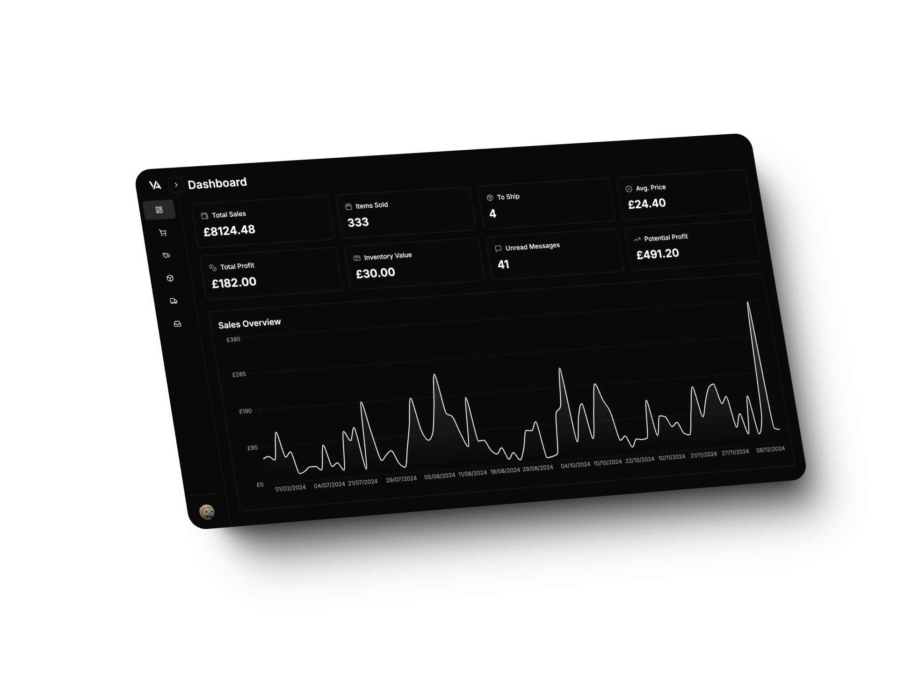

### Track Your Vinted Business With Data, Not Guesses

[Vinta](https://vinta.app) 

## 🚀 Features

### Analytics Dashboard
- Real-time sales tracking and performance metrics
- Comprehensive shop analytics
- Data-driven insights for business growth

### Order Management
- Automated order tracking system
- Instant notifications
- Streamlined shipment management
- Efficient customer communication tools

### Inventory Control
- SKU management and generation
- Stock level tracking
- Live listing performance monitoring
- Bulk operations for efficient management

### Financial Tools
- Cost and profit analysis
- CSV export functionality for tax returns
- Performance metrics and revenue tracking

### Automation
- Automated shipping label generation and cropping
- Bulk operations support

## 📊 Plans and Pricing

### Pro Plan - £29.99/month
- Unlimited listings
- Advanced analytics
- Priority support
- Bulk operations
- Real-time notifications
- Price optimization
- Inventory management
- Custom reports

---

Made with ❤️ for Vinted sellers

## :hammer: Tools

Developed with

### [cursor-tools](https://github.com/eastlondoner/cursor-tools)
Cursor-tools are tools that power up AI code generation. Cursor-tools works with any AI agent that can execute commands including Cursor Agent, Cline & Aider.

:link: [Build with AI: Smarter, faster, and better with **cursor-tools**](https://github.com/eastlondoner/cursor-tools)
